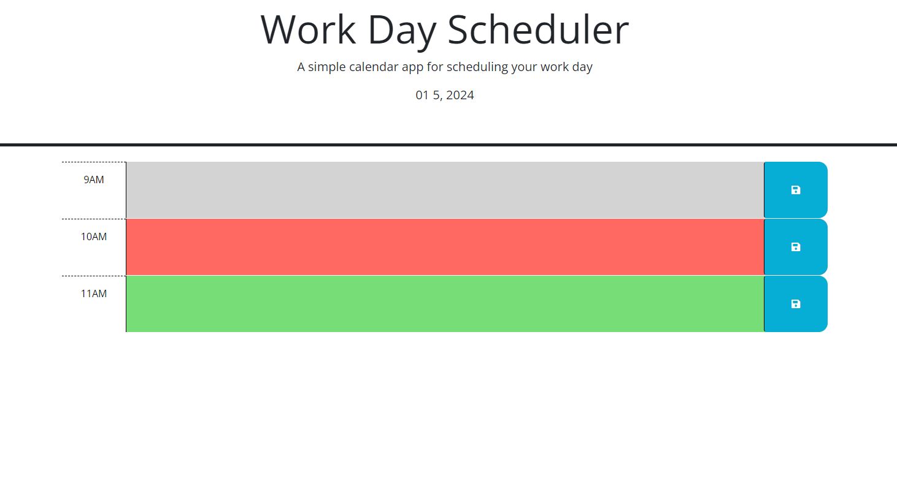

# Work-Day-Scheduler

## Description

A simple calendar app for scheduling your workday

## Installation

N/A

## Usage

Click this link https://m-beke.github.io/Work-Day-Scheduler/ to be taken to the application.

From there, you can enter text into each time box, and click the save button to add it to the planner to manage your time. The scheduler is color-coded; Gray means that time has already passed, red means that is the current time, and green means that time hasn't happened yet.

## Credits

MDN Web Docs, JQuery, Stack Overflow

## License

Please refer to the LICENSE in the repo.